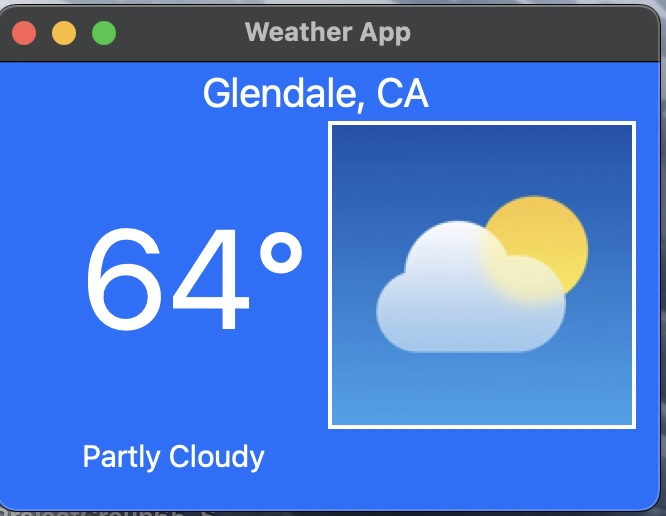

# Weather App 🌤️

This is a desktop GUI app that displays live weather information for Glendale, CA. Built using Python’s Tkinter library and web scraping using BeautifulSoup4.

## 🚀 Features
- Real-time weather updates for Glendale, CA
- Temperature, condition icons, and forecasts
- Auto-refreshes every 60 seconds
- GUI built with Python’s Tkinter library

## 🔧 Technologies Used
- Python 3
- Tkinter (for GUI)
- BeautifulSoup4 & Requests (for web scraping)

## 📌 Notes
🔒 The source code for this project is private.  

---

© 2025 Sienna R.
